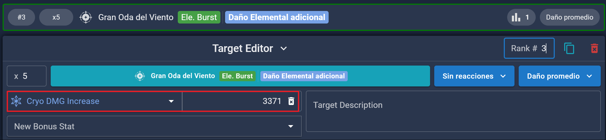
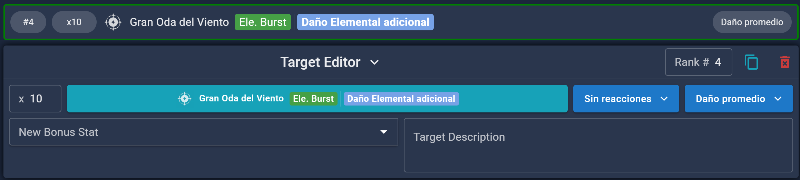

 

  

  <h1 align="center">Venti</h1>

  
<strong>Tabla de Contenido</strong>

  <ol>
    <li><a>Venti</a>
      <ul>
        <li><a href="#2-skills-1-burst">2 Skills 1 Burst</a><ul>
            <li><a href="#2e1q-single-target-9-swirls">2E1Q Single-Target (9 Swirls)</a></li>
            <li><a href="#2e1q-multi-target-18-swirls">2E1Q Multi-Target (18 Swirls)</a></li>
            <li><a href="#polar-star-2e1q-multi-target">Polar Star 2E1Q Multi-Target</a></li>
        </li>
      </ul>
    </li>
  </ol>

## 2 Skills 1 Burst

### [2E1Q Single-Target (9 Swirls)](2E1Q%20Single-Target%20(9%20Swirls).json)

**Autor:**
nociii and itslin  
**Explicación:**  
En la mayoría de los equipos, Venti podrá usar dos Habilidades Elementales y una Ulti en su rotación. Esto es bastante sencillo de optimizar para Venti C0. _Esta configuración es sólo para un objetivo (ST)_.  
**Ejemplo de Team:**  
`Venti - Ganyu - Mona - Layla`

> [!NOTE]
> La multioptimización es importante debido a las múltiples instancias de daño de Venti.

### Supuestos

- Asume 15 ticks de Daño elemental adicional. _El número real de ticks de Daño elemental adicional puede variar en función de tu ping y de cuándo se produzca la Absorción, pero entre 14 y 15 es razonable_.
- Asume 9 Swirls para simular un escenario Single-Target.
- Esta configuración asume un Venti C0.
- Si utilizas el set de 4 piezas de Sombra Verde, asegúrate de que el efecto de 4 piezas está activo y marcado con el elemento adecuado en la pestaña **"Ajustes de sets de artefactos"**. Por último, en la pestaña **"Talentos"**, comprueba que la Absorción elemental de su Ultimate está activa y ajustada al Elemento adecuado.
- La configuración usa **Cryo** como el elemento que hace swirl; cámbialo si estás haciendo swirl a otro elemento.
- Rotación de asumida: `Ganyu EQ > Venti EQ > Layla QE > Mona EQ > Ganyu 2[C] > Venti E > Ganyu C` _(Solo toma en cuenta que venti haga 2E1Q)_.

> [!WARNING]
> Cambia los Swirls en la configuración para que sean los Elementos correctos para tu equipo

### Personalización

- Si usas en el Team un personaje como **Shenhe**, en el "Daño elemental adicional"\*\* (en caso de que tenga cryo seleccionado) puedes hacer lo siguiente.

  - **#1** En la sección **"Multi-Target"**, cambia el valor de las instancias de **"Daño elemental adicional"** de 15 a **"5"** (o 7, dependiendo si usas E o hE en Shenhe). Adicionalmente a esto deberás agregar el atributo de **"Cryo DMG Increase"** y poner el bono correspondiente que da Shenhe.

    

  - **#2** Deberás agregar otro target de **"Daño elemental adicional"** y agregarle las instancias de daño restantes para llegar a 15 (a este no le agregaras ningún bono extra).

    

### [2E1Q Multi-Target (18 Swirls)](2E1Q%20Multi-Target%20(18%20Swirls).json)

<strong>Lo mismo que el anterior pero Multi target xD</strong>

> [!TIP]
> Si el elemento al que se hace Swirl es **Hydro**, divide las instancias de Swirl a la mitad.

### [Polar Star 2E1Q Multi-Target](Polar%20Star%202E1Q%20Multi-Target.json)

### Supuestos

- Rotación de asumida: `NA > Aimed Shot > E > Q > E`.

> [!CAUTION]
> Nota: Asegúrate de que las acumulaciones de `Estrella del Dia Polar` estén en `«Not Active»` en la pestaña Visión general.

### Personalización

- La Habilidad Definitiva (Burst) de Venti hace Snapshot (pero los Swirls no), por lo que puedes aplicar cualquier mejora relevante a todos los golpes de daño continuo (DoT) de la Definitiva y a los golpes de daño elemental adicional al mismo tiempo. Sin embargo, los Swirls aún deben calcularse de forma individual.

- Si tienes la C2, lo más sencillo es marcarla como activa en la pestaña de Talentos. Generalmente, es más seguro configurarla como **"Enemigo golpeado"** en lugar de **"Enemigo lanzado"**, ya que, incluso si un enemigo es lo suficientemente ligero para ser lanzado, el tiempo que realmente permanece en el aire puede ser impredecible.

- Si tienes la C4, puede ser mejor dejarla desmarcada y aplicar la mejora manualmente. Si realizas un combo rápido de Habilidad Elemental (E) y Definitiva (Q), las partículas generadas por la Habilidad de Venti generalmente no llegarán a tiempo para potenciar su Definitiva (que toma snapshot en el momento del lanzamiento). Si estás dispuesto a redirigir las partículas de otro personaje hacia Venti o a permanecer un tiempo en el campo para recoger sus propias partículas antes de lanzar su Definitiva, entonces puedes añadir el 25 % de bonificación de Daño Anemo a los golpes de daño continuo (DoT) de su Definitiva. Además, no todos los usos de la Habilidad Elemental pueden beneficiarse de la C4, dependiendo de la rotación, pero está bien simplemente activar el efecto para simplificar.

- Si Venti tiene C6, aplica manualmente la reducción de -20% de RES a los golpes de daño continuo (DoT) de su Definitiva, los golpes de daño elemental adicional y 14 de sus Swirls (7 Swirls en Sigle-Target). Una de sus Habilidades Elementales también puede beneficiarse (generando 1 o 2 Swirls adicionales). Si estás simulando a partir de la segunda rotación o prefieres asumir un tiempo activo del 100% de su C6, también puedes activarlo de forma permanente en la pestaña de Talentos.
